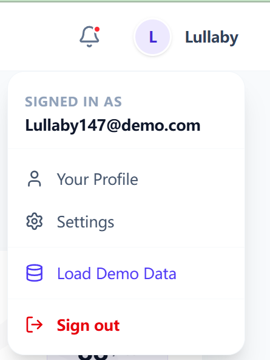
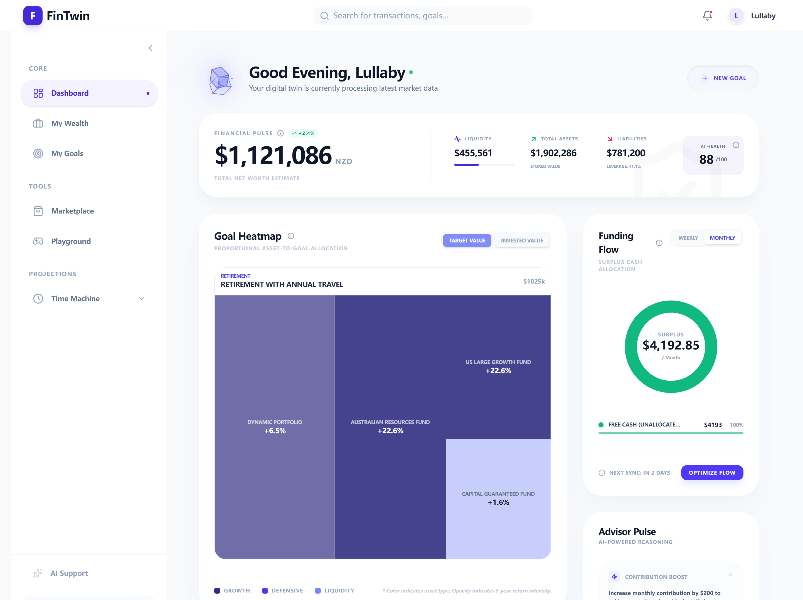
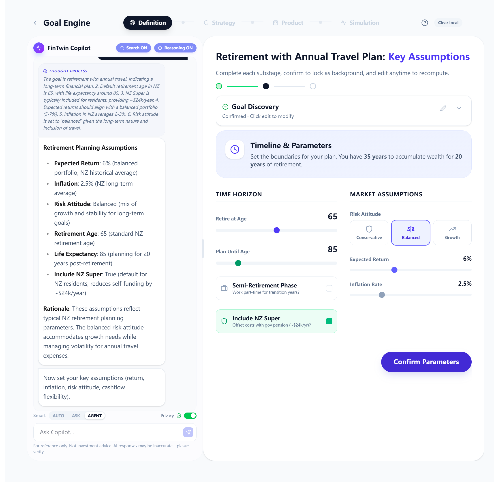
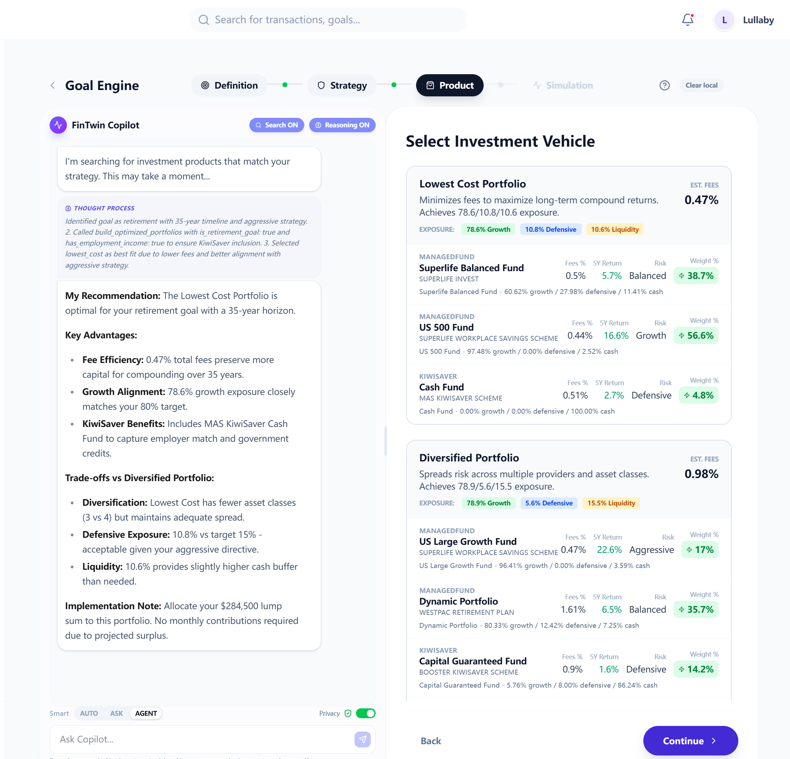

# FinTwin: AI-Powered Goal-Based Financial Planning

<div align="center">

**A neuro-symbolic AI system that helps users achieve their financial goals through personalized, transparent, and privacy-first investment planning.**

[](https://opensource.org/licenses/MIT)
[](https://github.com/CS778-LY-2025-Consulting-Challenge/Money-Minds/actions)
[](https://github.com/CS778-LY-2025-Consulting-Challenge/Money-Minds)
[](https://nodejs.org/)
[](https://reactjs.org/)
[](https://www.mongodb.com/)

[🚀 Live Demo](http://13.210.244.120/) • [Features](#-key-features) • [Installation](#-installation) • [Architecture](#-architecture) • [Team](#-team)

---

### 🌟 Quick Links
- **Try Now**: [Live Demo →](http://13.210.244.120/)
- **Documentation**: [See Below](#-table-of-contents)
- **GitHub**: [Repository](https://github.com/your-org/money-minds)

</div>

---

## 📖 Table of Contents

- [Overview](#-overview)
- [Key Features](#-key-features)
- [Demo](#-demo)
- [System Architecture](#-system-architecture)
- [Technology Stack](#-technology-stack)
- [Installation](#-installation)
- [Usage](#-usage)
- [Project Structure](#-project-structure)
- [Core Innovations](#-core-innovations)
- [API Documentation](#-api-documentation)
- [Testing & CI/CD](#-testing)
- [Contributing](#-contributing)
- [License](#-license)

---

## 🎯 Overview

FinTwin is a **goal-based financial planning platform** that combines Large Language Models (LLMs) with mathematical optimization algorithms to deliver transparent, personalized investment recommendations. Unlike traditional asset-centric approaches, FinTwin organizes all financial decisions around user-defined life goals—retirement, home purchase, education, wealth growth, and emergency funds.

### What Makes FinTwin Different?

**Traditional Approach:**
> "Here's a balanced portfolio for your risk profile."

**FinTwin's Approach:**
> "This retirement portfolio needs 73% growth exposure to achieve $1.025M by 2059 with 96% probability. Here's how each investment contributes to your specific goal."

### Core Philosophy

- **Goal-Centric Design**: Every financial decision is linked to a specific life goal with defined timeline, target amount, and risk tolerance
- **Neuro-Symbolic AI**: LLMs handle reasoning and context analysis (neural), while deterministic algorithms execute financial calculations (symbolic)
- **Complete Transparency**: Full audit trail of AI decisions with explainable recommendations and citations
- **Privacy-First**: Three-layer privacy controls with granular data sharing management

---

## ✨ Key Features

### 🎯 Goal-Based Planning
- **Four-Stage AI Pipeline**: Definition → Strategy → Product Selection → Simulation
- **Multi-Goal Optimization**: Automatically allocates limited resources across competing goals
- **Progress Tracking**: Real-time visualization of goal progress and success probability
- **Asset Linking**: Prevents double-counting by tracking which assets fund which goals

### 🤖 Hybrid AI Engine
- **Conversational AI**: Natural language Q&A with streaming responses
- **Function Calling**: LLM invokes computational tools for portfolio optimization
- **RAG Integration**: 501 curated document chunks from NZ financial regulations
- **Multi-Provider Support**: DeepSeek R1, GPT-4o, Gemini 1.5 Flash

### 💼 Wealth Management Center
- **Asset-Liability Tracking**: Real-time net worth calculation
- **Cash Flow Engine**: Monthly surplus analysis (income - expenses - goals)
- **Scenario Simulation**: Forward-looking projections (1-40 years)
- **Liquidity Analysis**: Three-tier asset classification (liquid/semi-liquid/locked)

### 📊 Portfolio Optimization
- **1,100+ Products**: KiwiSaver funds (339), managed funds (750+), term deposits
- **Automated Construction**: 3 portfolio options (lowest cost, diversified, balanced)
- **Constraint Satisfaction**: Product weights, exposure targets, fee limits
- **Monte Carlo Simulation**: 100 iterations with probabilistic outcome analysis

### 🔒 Privacy & Security
- **Three-Layer Protection**: Global toggle, granular allowlist, PII sanitization
- **Request-Level Override**: Per-conversation privacy control
- **GDPR-Compliant**: Automated scrubbing of personal identifiers
- **Audit Trail**: Complete decision logging for regulatory compliance

### 🧪 Advanced Features
- **Dynamic Form Generation**: AI-generated context-aware questionnaires
- **Session Isolation**: Prevents context leakage between goals
- **Intelligent Document Processing**: Automated quality filtering for RAG corpus
- **Background Tasks**: Asynchronous simulation execution with progress tracking
- **Comprehensive Testing**: 208 backend tests (13 suites), 23 E2E tests, stable CI/CD pipeline
- **Automated CI/CD**: GitHub Actions pipelines for testing, linting, and build verification

---

## 🎥 Demo

### 🌐 Live Demo

**Try FinTwin now:** [http://13.210.244.120/](http://13.210.244.120/)

> **Note**: This is a demo deployment hosted on AWS. Feel free to create an account and explore the features!

### 🎯 Quick Start with Demo Data

To quickly explore all features without manual data entry:

<table>
<tr>
<td width="70%">

**Steps:**
1. **Register/Login** to your account
2. **Click "Load Demo Data"** button in dashboard or settings
3. **Auto-populated content includes**:
   - Sample financial assets (savings, investments, property)
   - Monthly cash flows (income and expenses)
   - Multiple goal examples (retirement, home, education)
   - Realistic NZ-based financial scenarios

> **💡 Tip**: Demo data helps you understand the full workflow without manual setup. You can clear and start fresh anytime!

</td>
<td width="30%" align="center">



</td>
</tr>
</table>

### 📸 Screenshots

#### Dashboard Overview


#### AI-Powered Goal Planning


#### Portfolio Optimization


---

## 🏗 System Architecture

### High-Level Overview

```
┌─────────────────────────────────────────────────────────────────┐
│                    React Frontend (Vite)                        │
│  • Dynamic form rendering          • Real-time SSE streaming    │
│  • Session-based context isolation • Smart routing & navigation │
└────────────────────────────┬────────────────────────────────────┘
                             │ REST API + SSE
┌────────────────────────────▼────────────────────────────────────┐
│                  Node.js/Express Backend                        │
│  ┌──────────────────────────────────────────────────────────┐  │
│  │         Goal Engine Controller (Hybrid AI Core)          │  │
│  │  • Context enrichment       • Privacy filtering          │  │
│  │  • LLM orchestration        • Algorithm execution        │  │
│  │  • Decision logging         • Function calling           │  │
│  └────────┬──────────────────────────────────┬──────────────┘  │
│           │                                  │                  │
│  ┌────────▼─────────┐           ┌───────────▼──────────┐       │
│  │   LLM Service    │           │  Financial Algorithms│       │
│  │  • Multi-provider│           │  • Portfolio optimizer│       │
│  │  • RAG integration│           │  • Monte Carlo engine│       │
│  │  • Streaming     │           │  • Resource allocator│       │
│  └────────┬─────────┘           └───────────┬──────────┘       │
└───────────┼─────────────────────────────────┼──────────────────┘
            │                                 │
    ┌───────┴──────────┬─────────────────────┴────────┐
    │                  │                              │
    ▼                  ▼                              ▼
┌─────────┐    ┌──────────────┐            ┌──────────────┐
│ MongoDB │    │  DeepSeek R1 │            │   Vectara    │
│10 Models│    │   (LLM API)  │            │  (RAG Store) │
└─────────┘    └──────────────┘            └──────────────┘
```

### Architecture Layers

| Layer | Technology | Purpose |
|-------|-----------|---------|
| **Frontend** | React 19 + Vite 7 | Dynamic form rendering, session management, SSE streaming |
| **API** | Express 5 + Mongoose 9 | RESTful endpoints, AI-algorithm orchestration, privacy middleware |
| **AI Layer** | DeepSeek R1, GPT-4o, Gemini | Natural language reasoning, context analysis, function calling |
| **Algorithm Layer** | Custom implementations | Portfolio optimization, Monte Carlo simulation, linear programming |
| **RAG** | Vectara v2 | Semantic search over 501 cleaned document chunks |
| **Database** | MongoDB 6 | 10 collections with 50+ embedded schemas |

---

## 🛠 Technology Stack

### Backend
- **Runtime**: Node.js 20.x
- **Framework**: Express 5.x
- **Database**: MongoDB 6.x with Mongoose 9.x
- **AI/ML**: 
  - DeepSeek R1 (primary LLM)
  - GPT-4o (high-stakes decisions)
  - Gemini 1.5 Flash (document processing)
  - Vectara v2 (vector database for RAG)
- **Key Libraries**:
  - `@google/generative-ai` - Gemini API client
  - `glpk.js` - Linear programming for resource allocation
  - `pdf-parse`, `mammoth` - Document processing
  - `node-cron` - Scheduled tasks

### Frontend
- **Framework**: React 19.2
- **Build Tool**: Vite 7.x
- **UI Libraries**:
  - Tailwind CSS 4.x + DaisyUI 5.x
  - Material-UI 7.x
  - Recharts 3.x (charts)
  - Lucide React (icons)
- **Key Libraries**:
  - `react-markdown` - Markdown rendering
  - `react-router-dom` 7.x - Routing
  - `axios` - HTTP client
  - `katex` - Math formula rendering

### Development Tools
- **Testing**: 
  - Frontend: Vitest 4.x + Testing Library + Happy-DOM
  - Backend: Jest + Supertest
- **E2E Testing**: Cypress
- **Linting**: ESLint 9.x
- **CI/CD**: GitHub Actions (automated testing, linting, build verification)
- **Authentication**: JWT (jsonwebtoken)
- **Environment**: dotenv

---

## 🚀 Installation

### Prerequisites

- **Node.js**: v20.0.0 or higher
- **MongoDB**: v6.0 or higher (local or Atlas)
- **API Keys**:
  - DeepSeek API key (for primary LLM)
  - Vectara API key (for RAG)
  - (Optional) OpenAI API key for GPT-4o

### Step 1: Clone the Repository

```bash
git clone https://github.com/your-org/money-minds.git
cd money-minds
```

### Step 2: Install Dependencies

```bash
# Backend dependencies
cd backend
npm install

# Frontend dependencies
cd ../frontend
npm install
```

### Step 3: Environment Configuration

#### Backend Configuration

Create `backend/.env` file:

```env
# Database
MONGODB_URI=mongodb://localhost:27017/fintwin

# Server
PORT=5001
NODE_ENV=development

# JWT Authentication
JWT_SECRET=your-super-secret-jwt-key-change-this-in-production

# LLM Provider (options: deepseek, gemini, bedrock)
LLM_PROVIDER=deepseek

# DeepSeek API
DEEPSEEK_API_KEY=your-deepseek-api-key
DEEPSEEK_MODEL=deepseek-reasoner

# Gemini API (optional)
GEMINI_API_KEY=your-gemini-api-key
GEMINI_MODEL=gemini-1.5-flash

# OpenAI API (optional)
OPENAI_API_KEY=your-openai-api-key

# Vectara RAG
VECTARA_API_KEY=your-vectara-api-key
VECTARA_CUSTOMER_ID=your-customer-id
VECTARA_CORPUS_KEY=FinTwin_Docs

# Privacy & Sanitization
PRIVACY_SANITIZATION_MODE=pii_only
```

#### Frontend Configuration

Create `frontend/.env` file:

```env
# API Base URL
VITE_API_BASE_URL=http://localhost:5001/api

# Feature Flags (optional)
VITE_ENABLE_DEBUG=false
```

### Step 4: Initialize Database

```bash
cd backend

# Import financial products (KiwiSaver funds, managed funds)
npm run seed

# (Optional) Upload documents to Vectara for RAG
npm run update-kb
```

### Step 5: Start Development Servers

#### Terminal 1: Backend Server
```bash
cd backend
npm run dev
```
Server will start at `http://localhost:5001`

#### Terminal 2: Frontend Server
```bash
cd frontend
npm run dev
```
Frontend will start at `http://localhost:5173`

### Step 6: Access the Application

1. Open browser and navigate to `http://localhost:5173`
2. Register a new account
3. Complete the onboarding questionnaire
4. Start creating your first financial goal!

---

## 📚 Usage

### Creating Your First Goal

1. **Navigate to Goals Page**: Click "Goals" in the sidebar
2. **Create New Goal**: Click "Create Goal" button
3. **Choose Category**: Select from retirement, home purchase, education, wealth growth, or emergency fund
4. **AI-Guided Planning**: Follow the four-stage process:
   - **Definition**: Specify target amount, timeline, and priority
   - **Strategy**: AI recommends risk profile and contribution strategy
   - **Product Selection**: Choose from 3 optimized portfolios
   - **Simulation**: View Monte Carlo projections and success probability

### Managing Your Wealth

1. **Navigate to Wealth Center**: Click "Wealth" in the sidebar
2. **Add Assets**: Click "Add Asset" and categorize (cash, investments, property, etc.)
3. **Add Liabilities**: Record debts, mortgages, loans
4. **Track Cash Flow**: Add recurring income and expenses
5. **View Analytics**: Monitor net worth trends, liquidity analysis, and allocation charts

### Using the AI Chatbox

- **Ask Mode**: General financial questions with RAG-powered answers
- **Auto Mode**: Structured goal planning with form generation
- **Agent Mode**: Autonomous multi-step reasoning

### Privacy Controls

1. **Global Settings**: Navigate to Settings → Privacy
2. **Toggle AI Sharing**: Enable/disable data sharing with AI
3. **Granular Control**: Select which data types to share (assets, income, debts, etc.)
4. **Per-Request Override**: Use chatbox privacy toggle for one-time exceptions

### Running Tests Locally

Before committing changes, run tests locally to ensure code quality:

```bash
# Backend tests (Jest)
cd backend
npm test

# Frontend tests (Vitest)
cd frontend
npm test -- --run

# Frontend tests with coverage
npm test -- --run --coverage

# Linting
npm run lint

# Build verification
npm run build
```

**CI/CD Integration**: All tests run automatically via GitHub Actions on push/PR to main branches. Check the [Actions tab](https://github.com/CS778-LY-2025-Consulting-Challenge/Money-Minds/actions) for build status.

---

## 📁 Project Structure

```
money-minds/
├── backend/
│   ├── config/                 # Database configuration
│   ├── controllers/            # Route handlers (8 controllers)
│   ├── middleware/             # Auth, privacy, error handling
│   ├── models/                 # Mongoose schemas (10 models)
│   ├── routes/                 # API routes
│   ├── services/               # Business logic
│   │   ├── llmService.js       # LLM abstraction layer
│   │   ├── goalEnginePrompts.js # AI prompts (1,000+ lines)
│   │   ├── productTools.js     # Portfolio optimization
│   │   ├── vectaraClient.js    # RAG integration
│   │   └── ...
│   ├── scripts/                # Data processing & seeding
│   ├── utils/                  # Helpers & sanitizers
│   └── server.js               # Express app entry point
│
├── frontend/
│   ├── public/                 # Static assets
│   ├── src/
│   │   ├── components/         # Reusable components (60+)
│   │   │   ├── goals/          # Goal-related components
│   │   │   │   └── engine/     # AI engine components
│   │   │   ├── wealth/         # Wealth management components
│   │   │   └── ...
│   │   ├── pages/              # Route pages (25 pages)
│   │   │   ├── GoalIntakePage.jsx      # Main goal planning (1,909 lines)
│   │   │   ├── WealthCenterPage.jsx    # Wealth management
│   │   │   ├── Dashboard.jsx           # User dashboard
│   │   │   └── ...
│   │   ├── services/           # API clients
│   │   ├── utils/              # Helpers
│   │   └── App.jsx             # React app entry point
│   └── cypress/                # E2E tests
│
├── docs/                       # Additional documentation
└── README.md                   # This file
```

### Key Files

| File | Purpose | Lines |
|------|---------|-------|
| `backend/services/goalEnginePrompts.js` | AI prompts for 4-stage planning | ~1,000 |
| `backend/services/productTools.js` | Portfolio optimization algorithms | ~800 |
| `frontend/src/pages/GoalIntakePage.jsx` | Main goal planning interface | 1,909 |
| `frontend/src/components/goals/engine/Copilot.jsx` | AI chatbox component | 1,045 |
| `backend/specification.md` | Technical specification & formulas | 535 |

---

## 🔬 Core Innovations

### 1. Goal-Based Investment Framework

**Problem**: Traditional advice focuses on asset allocation without linking to specific life goals.

**Solution**: Full lifecycle goal management with automated resource allocation.

- **Asset Linking**: Each `FinancialAsset` can be linked to a specific goal via `linked_goal_id`
- **Resource Conflict Prevention**: System tracks allocated assets across goals to prevent double-counting
- **Multi-Goal Optimization**: Linear programming allocates limited resources across competing goals
- **Progress Tracking**: Real-time visualization of goal progress and success probability

**User Value**: Users see exactly how each investment contributes to specific life goals, making financial planning more tangible and motivating.

### 2. Neuro-Symbolic AI Architecture

**Design Principle**: Separate AI reasoning from algorithmic computation for reliability and explainability.

#### LLM Component (Neural)
- Natural language understanding of user goals
- Context-aware recommendation generation
- Document retrieval and synthesis (RAG)
- Intent classification (Ask vs. Auto mode)
- Function calling to invoke computational tools

#### Algorithmic Component (Symbolic)
- Portfolio optimization (gradient descent + greedy selection)
- Monte Carlo simulation (100 iterations with Box-Muller sampling)
- Multi-goal resource allocation (linear programming fallback)
- Cash flow calculations (deterministic arithmetic)

**Benefit**: LLM generates high-level strategy, algorithms execute precise calculations. Users can verify AI recommendations by inspecting the underlying mathematical models.

### 3. Explainable AI (XAI) Decision System

**Innovation**: Full audit trail of AI reasoning process through structured decision logs.

Every AI recommendation is persisted with:
- **Thought Process**: Step-by-step reasoning chain
- **Rationale**: Natural language explanation for end users
- **Evidence References**: Citations to regulatory documents (RAG sources)
- **Goal Snapshot**: Complete context at decision time
- **User Actions**: How user responded to recommendation (accepted/modified/rejected)

**Model**: `GoalDecisionLog` captures each step in the four-stage workflow, enabling retrospective analysis of AI decision quality and user trust patterns.

### 4. Privacy-First AI Architecture

**Challenge**: LLM APIs are third-party services—how to enable personalized advice while respecting data privacy?

#### Three-Layer Privacy Protection

**Layer 1: Global Sharing Control**
- User-level toggle: `privacy.shareWithAI` (boolean)
- If disabled, AI operates with only aggregate/anonymized data

**Layer 2: Granular Data Allowlist**
- Fine-grained control over data types sent to AI: `financial_assets`, `income`, `debts`, `goals`, `cashflow`
- Example: User allows AI to see income but not specific asset holdings

**Layer 3: PII Sanitization**
- Automated scrubbing before LLM transmission
- Removes: `user_id`, `email`, `name`, `address`, `session_id`
- Preserves: Financial values, ratios, and relationships
- Four sanitization modes: `none`, `pii_only`, `normalized`, `strict`

**Academic Value**: First implementation of GDPR-style consent management for LLM-based financial advisory.

### 5. Intelligent Document Processing Pipeline

**Problem**: Raw PDF/DOCX extracts contain noise (headers, footers, tables of contents) that degrade RAG quality.

#### Automated Cleaning Pipeline

**Stage 1: Content Type Detection**
- LLM-powered classification into 8 types: paragraph, table, list, figure_caption, TOC, header_footer, metadata_section, other

**Stage 2: Semantic Quality Filtering**
- LLM evaluates each chunk for: `content_quality` (high/medium/low), `priority`, `topic`, `audience`, `keywords`
- Code-level enforcement: Force-filter TOC and headers regardless of LLM judgment

**Stage 3: Metadata Enrichment**
- Auto-generates searchable attributes: topic taxonomy, document type, structural features

#### Performance Metrics
- **Input**: 6 documents, 293 pages, 678 raw chunks
- **Output**: 501 high-quality chunks (73.9% retention)
- **Quality Distribution**: ~78% high quality, 22% medium quality
- **Processing Cost**: $0.036 USD (Gemini 1.5 Flash)
- **Processing Time**: 30 minutes

**Research Impact**: Demonstrates feasibility of fully automated knowledge base curation for domain-specific RAG systems.

### 6. Dynamic Form Generation & Context Isolation

**Challenge**: Traditional financial planning uses static forms that cannot adapt to user context.

#### Dynamic Form Rendering System

AI generates form schemas on-the-fly based on:
- Goal category (retirement/home/education/wealth/emergency)
- Current stage (definition/strategy/product/simulation)
- User's financial context (employment status, existing goals, risk tolerance)

#### Context Isolation Architecture

**Solution**: Session-based isolation
- Each goal planning session has unique `session_id`
- Frontend maintains separate `goalContext` state per session
- Backend stores `previousDecisions` scoped to session
- Switching goals clears chatbox history and resets context

**Benefits**:
1. **Adaptive Questionnaires**: First-time home buyers see KiwiSaver withdrawal questions; investors don't
2. **Progressive Disclosure**: Only show advanced options when relevant
3. **Context-Aware Validation**: "Lump sum cannot exceed your available liquid assets ($84,500)"
4. **Seamless Resumption**: User can leave mid-planning and return later without losing progress

---

## 📡 API Documentation

### Base URL
```
http://localhost:5001/api
```

### Authentication

All protected endpoints require JWT token in header:
```http
Authorization: Bearer <your-jwt-token>
```

### Key Endpoints

#### Goal Management
```http
GET    /goals              # List all user goals
POST   /goals              # Create new goal
GET    /goals/:id          # Get goal details
PUT    /goals/:id          # Update goal
DELETE /goals/:id          # Delete goal
POST   /goals/:id/activate # Activate goal plan
```

#### AI Engine
```http
POST   /goal-engine/chat               # Conversational AI (Ask mode)
POST   /goal-engine/auto-substage      # Structured planning (Auto mode)
POST   /goal-engine/execute-substage   # Execute substage with AI
GET    /goal-engine/stream-chat        # SSE streaming endpoint
```

#### Wealth Management
```http
GET    /wealth/snapshot                # Current wealth snapshot
GET    /wealth/assets                  # List all assets
POST   /wealth/assets                  # Create asset
PUT    /wealth/assets/:id              # Update asset
DELETE /wealth/assets/:id              # Delete asset
GET    /wealth/cashflow                # Cash flow summary
POST   /wealth/cashflow                # Add cash flow item
```

#### Portfolio Optimization (Function Calling)
```http
POST   /products/build-portfolios      # Build optimized portfolios
POST   /products/search                # Search product library
GET    /products/recommendations       # Get product recommendations
```

For complete API documentation, see [API_REFERENCE.md](docs/API_REFERENCE.md).

---

## 🧪 Testing

### Run All Tests

```bash
# Backend tests (with coverage)
cd backend
npm test -- --coverage

# Backend tests (watch mode)
npm test -- --watch

# Frontend unit tests
cd frontend
npm run test

# Frontend E2E tests
cd frontend
npx cypress open
```

### Test Coverage

#### Backend Testing
- **Test Suites**: 13 suites, 208 tests (all passing) ✅

**Test Suites**:
- ✅ **Auth Middleware** (9 tests) - JWT authentication (91% coverage)
- ✅ **Privacy Middleware** (33 tests) - Data privacy controls (93% coverage)
- ✅ **Goal API** (8 tests) - Basic CRUD operations
- ✅ **Cash Flow API** (5 tests) - Income/expense management
- ✅ **Product API** (3 tests) - Financial product queries
- ✅ **User API** (3 tests) - User profile management
- ✅ **Snapshot API** (13 tests) - Wealth/goal history tracking
- ✅ **Wealth Helpers** (43 tests) - Financial calculations
- ✅ **Constants** (37 tests) - Configuration and enums
- ✅ **Memory Logger** (32 tests) - Debug logging
- ✅ **Error Handling** (9 tests) - Custom error classes
- ✅ **API Routes** (7 tests) - Route configuration

**Coverage Highlights**:
- Main API routes (Goal, Cash Flow, Product, User, Snapshot, Wealth Centre): 100%
- Privacy middleware: 93.47%
- Auth middleware: 90.9%
- Models: 57%

> **Note**: Complex business logic (AI engine, LLM integration, portfolio optimization algorithms) will be covered in future test iterations.

#### Frontend Testing
- **Unit Tests**: 5 test suites for goal engine components
- **E2E Tests**: 23 Cypress test files covering critical user workflows

### CI/CD Pipeline

The project includes automated GitHub Actions workflows:

#### **CI Pipeline** (`ci.yml`)
- **Frontend Tests**: Unit tests with coverage reporting
- **Backend Tests**: API and middleware tests
- **Code Quality**: ESLint checks and large file detection
- **Build Verification**: Production build validation and size monitoring

#### **Test Workflow** (`test.yml`)
- Matrix testing on Node.js 18.x and 20.x
- Automated testing on push/PR to main branches

#### **PR Protection** (`pr-protection.yml`)
- Large deletion detection (>1000 lines)
- Test file deletion warnings
- Prevents accidental code loss

For detailed CI/CD documentation, see [`.github/workflows/README.md`](.github/workflows/README.md)

### Contributing Tests

To add new tests:
1. Follow existing patterns in `backend/tests/`
2. Focus on pure functions and helper utilities
3. Ensure tests are stable and maintainable
4. Run `npm test` to verify all tests pass

---

## 🤝 Contributing

We welcome contributions from the community! Please follow these guidelines:

### Development Workflow

1. **Fork the repository**
2. **Create a feature branch**: `git checkout -b feature/amazing-feature`
3. **Make your changes**: Follow existing code style
4. **Test locally**: Run `npm test` in both frontend and backend directories
5. **Check linting**: Run `npm run lint` to ensure code quality
6. **Commit your changes**: `git commit -m 'Add amazing feature'`
7. **Push to the branch**: `git push origin feature/amazing-feature`
8. **Open a Pull Request**: Describe your changes in detail
9. **Wait for CI checks**: All automated tests must pass before merging

**⚠️ PR Guidelines:**
- CI pipeline will automatically run all tests
- Large deletions (>1000 lines) will trigger warnings
- Ensure test coverage for new features
- Fix any linting errors before requesting review

### Code Style

- **Backend**: Follow Node.js best practices, use ES6+ modules
- **Frontend**: Follow React best practices, use functional components and hooks
- **Formatting**: Use consistent indentation (2 spaces)
- **Comments**: Add JSDoc comments for functions and components
- **Naming**: Use camelCase for variables/functions, PascalCase for components/classes

### Commit Messages

Follow [Conventional Commits](https://www.conventionalcommits.org/):

```
feat: add Monte Carlo simulation dashboard
fix: resolve portfolio optimization bug
docs: update installation instructions
refactor: extract Copilot component from GoalIntakePage
test: add unit tests for privacy middleware
```

---

## 🗺 Roadmap

### Current Version: v1.0 (MVP)

- ✅ Goal-based planning (4-stage pipeline)
- ✅ Wealth management center
- ✅ Portfolio optimization (1,100+ products)
- ✅ Privacy-first AI architecture
- ✅ RAG integration (501 curated chunks)
- ✅ Monte Carlo simulation

### Version 1.1 (Q2 2026)

**Testing & Quality**:
- [ ] Maintain stable test suite (208 passing tests)
- [ ] Add E2E tests for critical user workflows
- [ ] Performance monitoring for AI response times

**Features**:
- [ ] Real-time market data integration
- [ ] Enhanced portfolio rebalancing
- [ ] Mobile-responsive design improvements
- [ ] Multi-currency support
- [ ] Tax optimization strategies

### Version 2.0 (Q3 2026)

- [ ] Multi-user support (family accounts)
- [ ] Financial advisor dashboard
- [ ] Advanced reporting & analytics
- [ ] API for third-party integrations
- [ ] Machine learning for personalized recommendations

### Future Considerations

- [ ] Mobile app (React Native)
- [ ] Voice assistant integration
- [ ] Blockchain-based asset verification
- [ ] Open-source product database
- [ ] Community-contributed goal templates

---

## 📄 License

This project is licensed under the MIT License - see the [LICENSE](LICENSE) file for details.

### MIT License Summary

```
Copyright (c) 2026 FinTwin Contributors

Permission is hereby granted, free of charge, to any person obtaining a copy
of this software and associated documentation files (the "Software"), to deal
in the Software without restriction, including without limitation the rights
to use, copy, modify, merge, publish, distribute, sublicense, and/or sell
copies of the Software...
```

---

## 📚 References & Data Sources

### Academic References

1. Financial Markets Authority (FMA). (2025). *KiwiSaver Annual Report 2025*.
2. Reserve Bank of New Zealand (RBNZ). (2025). *Monetary Policy Statement November 2025*.
3. Commission for Financial Capability (CFFC). (2024). *New Zealand Retirement Expenditure Guidelines*.
4. Ministry of Housing and Urban Development (MHUD). (2025). *Housing in Aotearoa 2025*.

### Data Providers

- **Financial Markets Authority (FMA)**: KiwiSaver product data (339 funds)
- **Managed Funds Association**: Managed fund data (750+ funds)
- **Banks**: Term deposit rates (limited coverage)
- **Vectara**: RAG platform (501 curated document chunks)
- **DeepSeek**: Primary LLM API
- **MongoDB**: Database infrastructure

> **Note**: Bank API integration is limited. The product database primarily focuses on investment products with extensible architecture for future data source expansion.

---

## 👥 Team

FinTwin was built by a collaborative team at the University of Auckland:

| Member | Role | Responsibilities |
|--------|------|-----------------|
| **Lucas** | Product Manager & Lead Engineer | Architecture design, AI/LLM integration, goal engine implementation, API design, database schema |
| **Kuda** | Project Manager & Data Lead | Project coordination, AWS deployment, financial compliance review, data cleaning & preparation |
| **Ray** | Backend Developer | CRUD API implementation, data persistence, backend-frontend integration, service layer maintenance |
| **Ming** | Frontend Developer | Data visualization (Recharts), component development, user research & requirements gathering |
| **Ava** | Frontend Developer & QA | User authentication UI, global styling, demo assets preparation, backend API testing, user testing & bug reporting |

---

## 🙏 Acknowledgments

Special thanks to:

- **University of Auckland, Department of Computer Science** - Research support and guidance
- **DeepSeek Team** - Providing accessible AI reasoning capabilities
- **Vectara Team** - Enabling powerful RAG infrastructure
- **Financial Markets Authority (NZ)** - Open data for financial products
- **Open Source Community** - Libraries and tools that made this possible

---

## 📧 Contact & Support

### Project Lead
- **Name**: Lucas
- **Role**: Product Owner & Lead Engineer
- **Institution**: University of Auckland, Department of Computer Science
- **Email**: [Contact via GitHub](https://github.com/your-org/money-minds)

### Getting Help

- **Live Demo**: [http://13.210.244.120/](http://13.210.244.120/)
- **Issues**: [GitHub Issues](https://github.com/your-org/money-minds/issues)
- **Discussions**: [GitHub Discussions](https://github.com/your-org/money-minds/discussions)

### Citation

If you use FinTwin in your research, please cite:

```bibtex
@software{fintwin2026,
  author = {Lucas and Kuda and Ray and Ming and Ava},
  title = {FinTwin: AI-Powered Goal-Based Financial Planning},
  year = {2026},
  publisher = {University of Auckland},
  url = {http://13.210.244.120/}
}
```

---

<div align="center">

**Built with ❤️ for better financial futures**

[⬆ Back to Top](#fintwin-ai-powered-goal-based-financial-planning)

</div>
